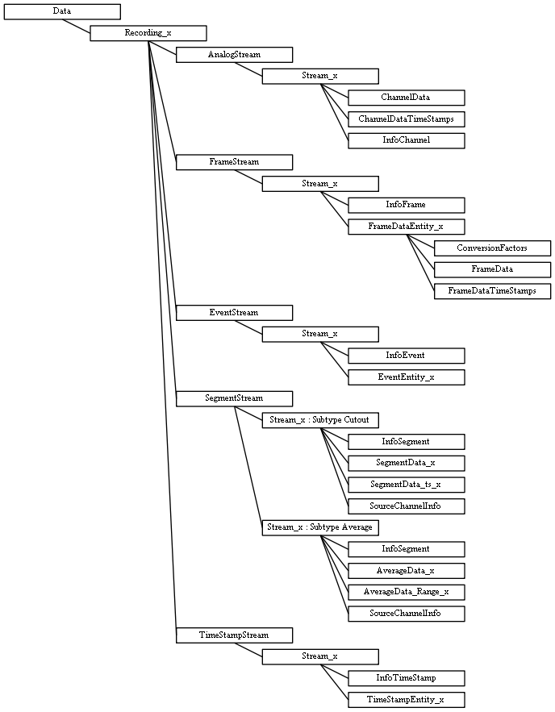

MCS HDF5 Format Definitions
===========================

Definition of the HDF5 format for raw data
------------------------------------------

MCS-HDF5 Protocol Type: RawData (Raw-Data protocol)

Protocol Version: 3 based on the definitions of RawDataFileIO in version
10.

All strings are only ASCII-encoded

Changelog
+++++++++

Version 1:

-  Initial draft

Version 2:

-  New Root-Folder attributes added to detect name and version of the
   creating application and library

Version 3:

-  Data structures for **DataSubType::Average** of
   **StreamType::Segment** added

Hierarchy
~~~~~~~~~

Root-Folder "/"
~~~~~~~~~~~~~~~

Contains all information for one experiment - measured data (inside the
folder Data) and a description (possibly in the future) inside the
folder Experiment/Description/...

Attributes:

+--------------------------------+--------------------------------------------------------------+------------------------------+-----------------------------+
| Name                           | Description                                                  | Data Type                    | MCS-HDF5 Protocol Version   |
+================================+==============================================================+==============================+=============================+
| McsHdf5ProtocolType            | | Type of the used MCS-HDF5 protocol definition              | [**String**,\ **Scalar**]    | 1 ≤                         |
|                                | | (e.g. **RawData** for the raw data MCS-HDF5 definitions)   |                              |                             |
+--------------------------------+--------------------------------------------------------------+------------------------------+-----------------------------+
| McsHdf5ProtocolVersion         | Version number of the used MCS-HDF5 protocol                 | [**Integer**,\ **Scalar**]   | 1 ≤                         |
+--------------------------------+--------------------------------------------------------------+------------------------------+-----------------------------+
| GeneratingApplicationName      | Name of the application that generated this HDF5 file        | [**String**,\ **Scalar**]    | 2 ≤                         |
+--------------------------------+--------------------------------------------------------------+------------------------------+-----------------------------+
| GeneratingApplicationVersion   | Version of the application that generated this HDF5 file     | [**String**,\ **Scalar**]    | 2 ≤                         |
+--------------------------------+--------------------------------------------------------------+------------------------------+-----------------------------+
| McsDataToolsVersion            | | Version of the McsDataTools library that was used          | [**String**,\ **Scalar**]    | 2 ≤                         |
|                                | | by the application to create the HDF5 file                 |                              |                             |
+--------------------------------+--------------------------------------------------------------+------------------------------+-----------------------------+

Datasets:

-  none

Folder "Data"
~~~~~~~~~~~~~

Navigation: /Data

Contains all recordings for this experiment.

Attributes:

+------------------+------------------------------------------------+---------------------------------------------+
| Name             | Description                                    | Data Type                                   |
+==================+================================================+=============================================+
| ProgramName      | Name of the recording program                  | [**String**,\ **Scalar**]                   |
+------------------+------------------------------------------------+---------------------------------------------+
| ProgramVersion   | Version number of the recording program        | [**String**,\ **Scalar**]                   |
+------------------+------------------------------------------------+---------------------------------------------+
| MeaName          | Name of the recorded MEA                       | [**String**,\ **Scalar**]                   |
+------------------+------------------------------------------------+---------------------------------------------+
| MeaLayout        | Layout descriptor                              | [**String**,\ **Scalar**]                   |
+------------------+------------------------------------------------+---------------------------------------------+
| MeaSN            | Serial number of the MEA                       | [**String**,\ **Scalar**]                   |
+------------------+------------------------------------------------+---------------------------------------------+
| Date             | Date of the recording                          | [**String**,\ **Scalar**]                   |
+------------------+------------------------------------------------+---------------------------------------------+
| DateInTicks      | Date of the recording in .NET ticks (100 ns)   | [**Long**\ (64-bit Integer),\ **Scalar**]   |
+------------------+------------------------------------------------+---------------------------------------------+
| FileGUID         | GUID of the converted raw data file            | [**String**,\ **Scalar**]                   |
+------------------+------------------------------------------------+---------------------------------------------+
| Comment          | Comment                                        | [**String**,\ **Scalar**]                   |
+------------------+------------------------------------------------+---------------------------------------------+

Datasets:

-  none

.. _mcs-hdf5-raw-recording-label:

Folder "Recording\_x"
~~~~~~~~~~~~~~~~~~~~~

Navigation: /Data/Recording\_x

Contains all recorded streams for recording x.

Attributes:

+-----------------+------------------------------------------------------------------------------+------------------------------------------------+
| Name            | Description                                                                  | Data Type                                      |
+=================+==============================================================================+================================================+
| RecordingID     | Recording ID                                                                 | [**Integer**\ (32-bit Integer),\ **Scalar**]   |
+-----------------+------------------------------------------------------------------------------+------------------------------------------------+
| RecordingType   | Recording type                                                               | [**String**,\ **Scalar**]                      |
+-----------------+------------------------------------------------------------------------------+------------------------------------------------+
| TimeStamp       | Start time of the recording in microseconds                                  | [**Long**\ (64-bit Integer),\ **Scalar**]      |
+-----------------+------------------------------------------------------------------------------+------------------------------------------------+
| Duration        | | Total recording duration in microseconds                                   | [**Long**\ (64-bit Integer),\ **Scalar**]      |
|                 | | (This duration can differ from the actual                                  |                                                |
|                 | | duration of the recorded data!!!)                                          |                                                |
+-----------------+------------------------------------------------------------------------------+------------------------------------------------+
| Label           | Label                                                                        | [**String**,\ **Scalar**]                      |
+-----------------+------------------------------------------------------------------------------+------------------------------------------------+
| Comment         | Comment                                                                      | [**String**,\ **Scalar**]                      |
+-----------------+------------------------------------------------------------------------------+------------------------------------------------+

Datasets:

-  none

.. _mcs-hdf5-raw-analogstreams-label:

Folder "AnalogStream"
~~~~~~~~~~~~~~~~~~~~~

Navigation: /Data/Recording\_x/AnalogStream

(Organisational) folder for all channel-based streams of this recording

Attributes:

-  none

Datasets:

-  none

.. _mcs-hdf5-raw-analogstream-label:

Sub-folder "Stream\_x" of "AnalogStream"
~~~~~~~~~~~~~~~~~~~~~~~~~~~~~~~~~~~~~~~~

Navigation: /Data/Recording\_x/AnalogStream/Stream\_x

Container for an analog stream

Attributes:

+---------------------+----------------------------------------------------+--------------------------------------------+---------------------+
| Name                | Description                                        | Data Type                                  | StreamInfoVersion   |
+=====================+====================================================+============================================+=====================+
| StreamInfoVersion   | Version number of the meta information structure   | [**Int**\ (32-bit Integer),\ **Scalar**]   | 1 ≤                 |
+---------------------+----------------------------------------------------+--------------------------------------------+---------------------+
| Label               | Label                                              | [**String**,\ **Scalar**]                  | 1 ≤                 |
+---------------------+----------------------------------------------------+--------------------------------------------+---------------------+
| SourceStreamGUID    | GUID of the source streams                         | [**String**,\ **Scalar**]                  | 1 ≤                 |
+---------------------+----------------------------------------------------+--------------------------------------------+---------------------+
| StreamGUID          | GUID                                               | [**String**,\ **Scalar**]                  | 1 ≤                 |
+---------------------+----------------------------------------------------+--------------------------------------------+---------------------+
| StreamType          | Type of the stream, e.g. **Electrode**             | [**String**,\ **Scalar**]                  | 1 ≤                 |
+---------------------+----------------------------------------------------+--------------------------------------------+---------------------+
| DataSubType         | Sub-type of the analog stream (e.g. **Analog**)    | [**String**,\ **Scalar**]                  | 1 ≤                 |
+---------------------+----------------------------------------------------+--------------------------------------------+---------------------+

Datasets:

-  Matrix InfoChannel → n × 16 matrix of describing information vectors
   for the n channels:

   -  Attributes: InfoVersion → Version number of the Info-Objects
      [**Int**\ (32-bit Integer),\ **Scalar**]

+---------------------------------+----------------------------------------------------------------------------+------------------------------------------------------+---------------+
| Name                            | Description                                                                | Data Type                                            | InfoVersion   |
+=================================+============================================================================+======================================================+===============+
| ChannelID                       | ID of the channel as given by the recording software                       | [**Int**\ (32-bit Integer),\ **Array**\ (Size 1)]    | 1 ≤           |
+---------------------------------+----------------------------------------------------------------------------+------------------------------------------------------+---------------+
| RowIndex                        | | Row number of this channel inside the **ChannelData** matrix where       | [**Int**\ (32-bit Integer),\ **Array**\ (Size 1)]    | 1 ≤           |
|                                 | |  the data of this channel is stored                                      |                                                      |               |
+---------------------------------+----------------------------------------------------------------------------+------------------------------------------------------+---------------+
| GroupID                         | ID of the group that this channel belongs to                               | [**Int**\ (32-bit Integer),\ **Array**\ (Size 1)]    | 1 ≤           |
+---------------------------------+----------------------------------------------------------------------------+------------------------------------------------------+---------------+
| Label                           | Label of the channel                                                       | [**String**,\ **Array**]                             | 1 ≤           |
+---------------------------------+----------------------------------------------------------------------------+------------------------------------------------------+---------------+
| RawDataType                     | Type of the raw data                                                       | [**String**,\ **Array**]                             | 1 ≤           |
+---------------------------------+----------------------------------------------------------------------------+------------------------------------------------------+---------------+
| Unit                            | Physical unit of the measured sensor value                                 | [**String**,\ **Array**]                             | 1 ≤           |
+---------------------------------+----------------------------------------------------------------------------+------------------------------------------------------+---------------+
| Exponent                        | | Exponent n ⇒ 1En resp. 10\ :sup:`n` in which the channel values          | [**Int**\ (32-bit Integer),\ **Array**\ (Size 1)]    | 1 ≤           |
|                                 | |  magnitude is measured (e.g. k,m,µ,...)                                  |                                                      |               |
+---------------------------------+----------------------------------------------------------------------------+------------------------------------------------------+---------------+
| ADZero                          | ADC-Step that represents the 0-point of the measuring range of the ADC     | [**Int**\ (32-bit Integer),\ **Array**\ (Size 1)]    | 1 ≤           |
+---------------------------------+----------------------------------------------------------------------------+------------------------------------------------------+---------------+
| Tick                            | | Sample tick Δ between two sample points of a channel in µs               | [**Long**\ (64-bit Integer),\ **Array**\ (Size 1)]   | 1 ≤           |
|                                 | |  ⇒ sampling frequency = 1000000 / Δ                                      |                                                      |               |
+---------------------------------+----------------------------------------------------------------------------+------------------------------------------------------+---------------+
| ConversionFactor                | Conversion factor for the mapping ADC-Step ⇒ measured value                | [**Long**\ (64-bit Integer),\ **Array**\ (Size 1)]   | 1 ≤           |
+---------------------------------+----------------------------------------------------------------------------+------------------------------------------------------+---------------+
| ADCBits                         | Number of bits used by the AD-Converter                                    | [**Int**\ (32-bit Integer),\ **Array**\ (Size 1)]    | 1 ≤           |
+---------------------------------+----------------------------------------------------------------------------+------------------------------------------------------+---------------+
| HighPassFilterType              | Type of the high-pass filter (empty string if not available)               | [**String**,\ **Scalar**]                            | 1 ≤           |
+---------------------------------+----------------------------------------------------------------------------+------------------------------------------------------+---------------+
| HighPassFilterCutOffFrequency   | Cut-off frequency of the high-pass filter ('-1'-String if not available)   | [**String**,\ **Scalar**]                            | 1 ≤           |
+---------------------------------+----------------------------------------------------------------------------+------------------------------------------------------+---------------+
| HighPassFilterOrder             | Order of the high-pass filter (-1 if not available)                        | [**Int**\ (32-bit Integer),\ **Array**\ (Size 1)]    | 1 ≤           |
+---------------------------------+----------------------------------------------------------------------------+------------------------------------------------------+---------------+
| LowPassFilterType               | Type of the low-pass filter (empty string if not available)                | [**String**,\ **Scalar**]                            | 1 ≤           |
+---------------------------------+----------------------------------------------------------------------------+------------------------------------------------------+---------------+
| LowPassFilterCutOffFrequency    | Cut-off frequency of the low-pass filter ('-1'-String if not available)    | [**String**,\ **Scalar**]                            | 1 ≤           |
+---------------------------------+----------------------------------------------------------------------------+------------------------------------------------------+---------------+
| LowPassFilterOrder              | Order of the low-pass filter (-1 if not available)                         | [**Int**\ (32-bit Integer),\ **Array**\ (Size 1)]    | 1 ≤           |
+---------------------------------+----------------------------------------------------------------------------+------------------------------------------------------+---------------+

-  2-dimensional Data-Matrix ChannelData → Data for sampled channels
   organized as n × m matrix ⇒ one row per channel and one column per
   sample time point

   -  reconstruct the value of the measured signal:
      :math:`y(\text{channel},t_{ind}) = (\text{ChannelData}[\text{InfoChannel}[\text{channel}].\text{RowIndex},t_{ind}] - \text{ADZero}) * \text{InfoChannel}[\text{channel}].\text{ConversionFactor} * 10^{\text{InfoChannel}[\text{channel}].\text{Exponent}}`
      in :math:`\text{InfoChannel}[\text{channel}].\text{Unit}`
   -  reconstruct the sample time point:
      :math:`t = t_{ind} * \text{InfoChannel}[\text{channel}].\text{Tick}`
      in :math:`\mu s`

-  Matrix ChannelDataTimeStamps → k × 3 matrix of segments where the
   rows are one segment and the columns are:

   -  first column → time stamp of the first sample point of the segment
   -  second column → first index (column) of the segment in
      **ChannelData**
   -  third column → last index (column) of the segment in
      **ChannelData**

.. _mcs-hdf5-raw-framestreams-label:
	  
Folder "FrameStream"
~~~~~~~~~~~~~~~~~~~~

Navigation: /Data/Recording\_x/FrameStream

(Organisational) folder for all frame-based streams of this recording

Attributes:

-  none

Datasets:

-  none

.. _mcs-hdf5-raw-framestream-label:

Subfolder "Stream\_x" of "FrameStream"
~~~~~~~~~~~~~~~~~~~~~~~~~~~~~~~~~~~~~~

Navigation: /Data/Recording\_x/FrameStream/Stream\_x

Folder that contains all Frame-Entities of one Frame-Stream:

Attributes:

+---------------------+----------------------------------------------------------+--------------------------------------------+---------------------+
| Name                | Description                                              | Data Type                                  | StreamInfoVersion   |
+=====================+==========================================================+============================================+=====================+
| StreamInfoVersion   | Version number of the meta information structure         | [**Int**\ (32-bit Integer),\ **Scalar**]   | 1 ≤                 |
+---------------------+----------------------------------------------------------+--------------------------------------------+---------------------+
| Label               | Label                                                    | [**String**,\ **Scalar**]                  | 1 ≤                 |
+---------------------+----------------------------------------------------------+--------------------------------------------+---------------------+
| SourceStreamGUID    | GUID of the source stream                                | [**String**,\ **Scalar**]                  | 1 ≤                 |
+---------------------+----------------------------------------------------------+--------------------------------------------+---------------------+
| StreamGUID          | GUID                                                     | [**String**,\ **Scalar**]                  | 1 ≤                 |
+---------------------+----------------------------------------------------------+--------------------------------------------+---------------------+
| StreamType          | Type of the stream **Frame**                             | [**String**,\ **Scalar**]                  | 1 ≤                 |
+---------------------+----------------------------------------------------------+--------------------------------------------+---------------------+
| DataSubType         | Sub-type of the event stream (e.g. **SpikeTimeStamp**)   | [**String**,\ **Scalar**]                  | 1 ≤                 |
+---------------------+----------------------------------------------------------+--------------------------------------------+---------------------+

Datasets:

-  Matrix InfoFrame → n × 24 matrix of describing information vectors
   for the n Frame-Entities:

   -  Attributes: InfoVersion → Version number of the Info-Objects
      [**Int**\ (32-bit Integer),\ **Scalar**]

+---------------------------------+-------------------------------------------------------------------------------------------------+------------------------------------------------------+---------------+
| Name                            | Description                                                                                     | Data Type                                            | InfoVersion   |
+=================================+=================================================================================================+======================================================+===============+
| FrameID                         | ID of the frame entity as given by the recording software                                       | [**Int**\ (32-bit Integer),\ **Array**\ (Size 1)]    | 1 ≤           |
+---------------------------------+-------------------------------------------------------------------------------------------------+------------------------------------------------------+---------------+
| FrameDataID                     | | ID of the frame entity inside the stream folder that maps this information                    | [**Int**\ (32-bit Integer),\ **Array**\ (Size 1)]    | 1 ≤           |
|                                 | |  vector to the entity folder (**FrameDataID** → subfolder **FrameDataEntity\_FrameDataID**)   |                                                      |               |
+---------------------------------+-------------------------------------------------------------------------------------------------+------------------------------------------------------+---------------+
| GroupID                         | ID of the group that this frame entity belongs to                                               | [**Int**\ (32-bit Integer),\ **Array**\ (Size 1)]    | 1 ≤           |
+---------------------------------+-------------------------------------------------------------------------------------------------+------------------------------------------------------+---------------+
| Label                           | Label of the entity                                                                             | [**String**,\ **Array**]                             | 1 ≤           |
+---------------------------------+-------------------------------------------------------------------------------------------------+------------------------------------------------------+---------------+
| RawDataType                     | Type of the raw data                                                                            | [**String**,\ **Array**]                             | 1 ≤           |
+---------------------------------+-------------------------------------------------------------------------------------------------+------------------------------------------------------+---------------+
| Unit                            | Physical unit of the measured sensor value                                                      | [**String**,\ **Array**]                             | 1 ≤           |
+---------------------------------+-------------------------------------------------------------------------------------------------+------------------------------------------------------+---------------+
| Exponent                        | | Exponent n ⇒ 1En resp. 10\ :sup:`n` in which the sensor values magnitude                      | [**Int**\ (32-bit Integer),\ **Array**\ (Size 1)]    | 1 ≤           |
|                                 | |  is measured (e.g. k,m,µ,...)                                                                 |                                                      |               |
+---------------------------------+-------------------------------------------------------------------------------------------------+------------------------------------------------------+---------------+
| ADZero                          | ADC-Step that represents the 0-point of the measuring range of the ADC                          | [**Int**\ (32-bit Integer),\ **Array**\ (Size 1)]    | 1 ≤           |
+---------------------------------+-------------------------------------------------------------------------------------------------+------------------------------------------------------+---------------+
| ADCBits                         | Number of bits used by the AD-Converter                                                         | [**Int**\ (32-bit Integer),\ **Array**\ (Size 1)]    | 1 ≤           |
+---------------------------------+-------------------------------------------------------------------------------------------------+------------------------------------------------------+---------------+
| Tick                            | | Sample tick Δ between two frames in µs                                                        | [**Long**\ (64-bit Integer),\ **Array**\ (Size 1)]   | 1 ≤           |
|                                 | | ⇒ sampling frequency = 1000000 / Δ                                                            |                                                      |               |
+---------------------------------+-------------------------------------------------------------------------------------------------+------------------------------------------------------+---------------+
| HighPassFilterType              | Type of the high-pass filter (empty string if not available)                                    | [**String**,\ **Scalar**]                            | 1 ≤           |
+---------------------------------+-------------------------------------------------------------------------------------------------+------------------------------------------------------+---------------+
| HighPassFilterCutOffFrequency   | Cut-off frequency of the high-pass filter ('-1'-String if not available)                        | [**String**,\ **Scalar**]                            | 1 ≤           |
+---------------------------------+-------------------------------------------------------------------------------------------------+------------------------------------------------------+---------------+
| HighPassFilterOrder             | Order of the high-pass filter (-1 if not available)                                             | [**Int**\ (32-bit Integer),\ **Array**\ (Size 1)]    | 1 ≤           |
+---------------------------------+-------------------------------------------------------------------------------------------------+------------------------------------------------------+---------------+
| LowPassFilterType               | Type of the low-pass filter (empty string if not available)                                     | [**String**,\ **Scalar**]                            | 1 ≤           |
+---------------------------------+-------------------------------------------------------------------------------------------------+------------------------------------------------------+---------------+
| LowPassFilterCutOffFrequency    | Cut-off frequency of the low-pass filter ('-1'-String if not available)                         | [**String**,\ **Scalar**]                            | 1 ≤           |
+---------------------------------+-------------------------------------------------------------------------------------------------+------------------------------------------------------+---------------+
| LowPassFilterOrder              | Order of the low-pass filter (-1 if not available)                                              | [**Int**\ (32-bit Integer),\ **Array**\ (Size 1)]    | 1 ≤           |
+---------------------------------+-------------------------------------------------------------------------------------------------+------------------------------------------------------+---------------+
| SensorSpacing                   | Distance between adjacent sensors in µm                                                         | [**Int**\ (32-bit Integer),\ **Array**\ (Size 1)]    | 1 ≤           |
+---------------------------------+-------------------------------------------------------------------------------------------------+------------------------------------------------------+---------------+
| FrameLeft                       | Sensor count of the left edge of the entity frame based on the reference frame                  | [**Int**\ (32-bit Integer),\ **Array**\ (Size 1)]    | 1 ≤           |
+---------------------------------+-------------------------------------------------------------------------------------------------+------------------------------------------------------+---------------+
| FrameTop                        | Sensor count of the top edge of the entity frame based on the reference frame                   | [**Int**\ (32-bit Integer),\ **Array**\ (Size 1)]    | 1 ≤           |
+---------------------------------+-------------------------------------------------------------------------------------------------+------------------------------------------------------+---------------+
| FrameRight                      | Sensor count of the right edge of the entity frame based on the reference frame                 | [**Int**\ (32-bit Integer),\ **Array**\ (Size 1)]    | 1 ≤           |
+---------------------------------+-------------------------------------------------------------------------------------------------+------------------------------------------------------+---------------+
| FrameBottom                     | Sensor count of the bottom edge of the entity frame based on the reference frame                | [**Int**\ (32-bit Integer),\ **Array**\ (Size 1)]    | 1 ≤           |
+---------------------------------+-------------------------------------------------------------------------------------------------+------------------------------------------------------+---------------+
| ReferenceFrameLeft              | | Sensor count of the left edge of the reference frame                                          | [**Int**\ (32-bit Integer),\ **Array**\ (Size 1)]    | 1 ≤           |
|                                 | |  (defined by the used sensor array)                                                           |                                                      |               |
+---------------------------------+-------------------------------------------------------------------------------------------------+------------------------------------------------------+---------------+
| ReferenceFrameTop               | | Sensor count of the left edge of the reference frame                                          | [**Int**\ (32-bit Integer),\ **Array**\ (Size 1)]    | 1 ≤           |
|                                 | |  (defined by the used sensor array)                                                           |                                                      |               |
+---------------------------------+-------------------------------------------------------------------------------------------------+------------------------------------------------------+---------------+
| ReferenceFrameRight             | | Sensor count of the left edge of the reference frame                                          | [**Int**\ (32-bit Integer),\ **Array**\ (Size 1)]    | 1 ≤           |
|                                 | |  (defined by the used sensor array)                                                           |                                                      |               |
+---------------------------------+-------------------------------------------------------------------------------------------------+------------------------------------------------------+---------------+
| ReferenceFrameBottom            | | Sensor count of the left edge of the reference frame                                          | [**Int**\ (32-bit Integer),\ **Array**\ (Size 1)]    | 1 ≤           |
|                                 | |  (defined by the used sensor array)                                                           |                                                      |               |
+---------------------------------+-------------------------------------------------------------------------------------------------+------------------------------------------------------+---------------+

.. _mcs-hdf5-raw-framestream-entity-label:

Subfolder "FrameDataEntity\_x"
~~~~~~~~~~~~~~~~~~~~~~~~~~~~~~

Navigation: /Data/Recording\_x/FrameStream/Stream\_x/FrameDataEntity\_x

Contains all datasets of the Frame-Entity x

Datasets:

-  Matrix ConversionFactors → n × m matrix of conversion factors for the
   sensor array
-  3-dimensional Data-Cube FrameData → cube of the frame data organized
   as one frame to one sample time point (n × m matrix of sampled signal
   values per sensor) × sample time points

   -  reconstruct the value of the measured signal: y =
      (FrameData[x,y,t] - ADZero) \* ConversionFactors[x,y]
   -  reconstruct the sample time point:

-  Matrix FrameDataTimeStamps → k × 3 matrix of segments where the rows
   are one segment and the columns are:

   -  first column → time stamp of the first sample point of the segment
   -  second column → first index (z-axis) of the segment in
      **FrameData**
   -  third column → last index (z-axis) of the segment in **FrameData**

Datasets:

-  none

.. _mcs-hdf5-raw-eventstreams-label:

Folder "EventStream"
~~~~~~~~~~~~~~~~~~~~

Navigation: /Data/Recording\_x/EventStream

(Organisational) folder for all event-based streams of this recording

Attributes:

-  none

Datasets:

-  none

.. _mcs-hdf5-raw-eventstream-label:

Subfolder "Stream\_x" of "EventStream"
~~~~~~~~~~~~~~~~~~~~~~~~~~~~~~~~~~~~~~

Navigation: /Data/Recording\_x/EventStream/Stream\_x

Folder that contains all Event-Entities of one Event-Stream:

Attributes:

+---------------------+---------------------------------------------------------------------------------------+--------------------------------------------+---------------------+
| Name                | Description                                                                           | Data Type                                  | StreamInfoVersion   |
+=====================+=======================================================================================+============================================+=====================+
| StreamInfoVersion   | Version number of the meta information structure                                      | [**Int**\ (32-bit Integer),\ **Scalar**]   | 1 ≤                 |
+---------------------+---------------------------------------------------------------------------------------+--------------------------------------------+---------------------+
| Label               | Label                                                                                 | [**String**,\ **Scalar**]                  | 1 ≤                 |
+---------------------+---------------------------------------------------------------------------------------+--------------------------------------------+---------------------+
| SourceStreamGUID    | GUID of the source stream                                                             | [**String**,\ **Scalar**]                  | 1 ≤                 |
+---------------------+---------------------------------------------------------------------------------------+--------------------------------------------+---------------------+
| StreamGUID          | GUID of the current stream                                                            | [**String**,\ **Scalar**]                  | 1 ≤                 |
+---------------------+---------------------------------------------------------------------------------------+--------------------------------------------+---------------------+
| StreamType          | Type of the stream **Event**                                                          | [**String**,\ **Scalar**]                  | 1 ≤                 |
+---------------------+---------------------------------------------------------------------------------------+--------------------------------------------+---------------------+
| DataSubType         | Sub-type of the event stream (e.g. **StgSideband**, **UserInput**, **DigitalPort**)   | [**String**,\ **Scalar**]                  | 1 ≤                 |
+---------------------+---------------------------------------------------------------------------------------+--------------------------------------------+---------------------+

Sub-type Description:

-  StgSideband → The event is associated to a STG sideband change.
-  UserInput → The event is associated with an user input.
-  DigitalPort → The event is associated with a digital port change.

Datasets:

-  Matrix InfoEvent → n × 7 matrix of describing information vectors for
   the n Event-Entities:

   -  Attributes: InfoVersion → Version number of the Info-Objects
      [**Int**\ (32-bit Integer),\ **Scalar**]

+-----------------------+----------------------------------------------------------------+-----------------------------------------------------+---------------+
| Name                  | Description                                                    | Data Type                                           | InfoVersion   |
+=======================+================================================================+=====================================================+===============+
| EventID               | ID of the event entity                                         | [**Int**\ (32-bit Integer),\ **Array**\ (Size 1)]   | 1 ≤           |
+-----------------------+----------------------------------------------------------------+-----------------------------------------------------+---------------+
| GroupID               | ID of the group that the entity belongs to                     | [**Int**\ (32-bit Integer),\ **Array**\ (Size 1)]   | 1 ≤           |
+-----------------------+----------------------------------------------------------------+-----------------------------------------------------+---------------+
| Label                 | Label of the entity                                            | [**String**,\ **Array**]                            | 1 ≤           |
+-----------------------+----------------------------------------------------------------+-----------------------------------------------------+---------------+
| RawDataType           | Type of the raw data                                           | [**String**,\ **Array**]                            | 1 ≤           |
+-----------------------+----------------------------------------------------------------+-----------------------------------------------------+---------------+
| RawDataBytes          | Number of bytes of the raw data type                           | [**Int**\ (32-bit Integer),\ **Array**\ (Size 1)]   | 1 ≤           |
+-----------------------+----------------------------------------------------------------+-----------------------------------------------------+---------------+
| SourceChannelIDs      | | Comma separated list of ID's of (source) channel that were   | [**String**,\ **Array**]                            | 1 ≤           |
|                       | |  involved in the generation of this event                    |                                                     |               |
+-----------------------+----------------------------------------------------------------+-----------------------------------------------------+---------------+
| SourceChannelLabels   | Comma separated list of labels of the source channels          | [**String**,\ **Scalar**]                           | 1 ≤           |
+-----------------------+----------------------------------------------------------------+-----------------------------------------------------+---------------+

-  2-dimensional matrix EventEntity\_x → 2 × n matrix ⇒ n events with
   describing vector (time stamp of event, duration of event)

   -  Attributes: Short description of content
   -  :math:`t_\text{event i} = \text{EventEntity}\_x[0,i]` in
      :math:`\mu s`
   -  :math:`\Delta_\text{event i} = \text{EventEntity}\_x[1,i]` in
      :math:`\mu s`

.. _mcs-hdf5-raw-segmentstreams-label:
	  
Folder "SegmentStream"
~~~~~~~~~~~~~~~~~~~~~~

Navigation: /Data/Recording\_x/SegmentStream

(Organisational) folder for all segment-based streams of this recording.
A segment is a cutout of parts of the sampled signal relative to an
event, defined by a pre- and post interval.

Attributes:

-  none

Datasets:

-  none

.. _mcs-hdf5-raw-segmentstream-label:

Subfolder "Stream\_x" of "SegmentStream"
~~~~~~~~~~~~~~~~~~~~~~~~~~~~~~~~~~~~~~~~

Navigation: /Data/Recording\_x/SegmentStream/Stream\_x

Folder that contains all Segment-Entities of one Segment-Stream:

Attributes:

+---------------------+----------------------------------------------------+--------------------------------------------+---------------------+
| Name                | Description                                        | Data Type                                  | StreamInfoVersion   |
+=====================+====================================================+============================================+=====================+
| StreamInfoVersion   | Version number of the meta information structure   | [**Int**\ (32-bit Integer),\ **Scalar**]   | 1 ≤                 |
+---------------------+----------------------------------------------------+--------------------------------------------+---------------------+
| Label               | Label                                              | [**String**,\ **Scalar**]                  | 1 ≤                 |
+---------------------+----------------------------------------------------+--------------------------------------------+---------------------+
| SourceStreamGUID    | GUID of the source stream                          | [**String**,\ **Scalar**]                  | 1 ≤                 |
+---------------------+----------------------------------------------------+--------------------------------------------+---------------------+
| StreamGUID          | GUID of the current stream                         | [**String**,\ **Scalar**]                  | 1 ≤                 |
+---------------------+----------------------------------------------------+--------------------------------------------+---------------------+
| StreamType          | Type of the stream **Segment**                     | [**String**,\ **Scalar**]                  | 1 ≤                 |
+---------------------+----------------------------------------------------+--------------------------------------------+---------------------+
| DataSubType         | Sub-type of the segment stream (e.g. **Spike**)    | [**String**,\ **Scalar**]                  | 1 ≤                 |
+---------------------+----------------------------------------------------+--------------------------------------------+---------------------+

Datasets:

-  Matrix InfoSegment → n × 7 matrix of describing information vectors
   for the n Segment-Entities:

   -  Attributes: InfoVersion → Version number of the Info-Objects
      [**Int**\ (32-bit Integer),\ **Scalar**]

+--------------------+--------------------------------------------------------------------------------------------+-----------------------------------------------------+---------------+
| Name               | Description                                                                                | Data Type                                           | InfoVersion   |
+====================+============================================================================================+=====================================================+===============+
| SegmentID          | ID of the segment entity                                                                   | [**Int**\ (32-bit Integer),\ **Array**\ (Size 1)]   | 1 ≤           |
+--------------------+--------------------------------------------------------------------------------------------+-----------------------------------------------------+---------------+
| GroupID            | ID of the group that the segment entity belongs to                                         | [**Int**\ (32-bit Integer),\ **Array**\ (Size 1)]   | 1 ≤           |
+--------------------+--------------------------------------------------------------------------------------------+-----------------------------------------------------+---------------+
| Label              | Label of the entity                                                                        | [**String**,\ **Array**]                            | 1 ≤           |
+--------------------+--------------------------------------------------------------------------------------------+-----------------------------------------------------+---------------+
| PreInterval        | | Time interval in µs before the segment defining event occured                            | [**Int**\ (64-bit Integer),\ **Array**\ (Size 1)]   | 1 ≤           |
|                    | |  - definition of the beginning of the segment                                            |                                                     |               |
+--------------------+--------------------------------------------------------------------------------------------+-----------------------------------------------------+---------------+
| PostInterval       | | Time interval in µs after the segment defining event occured                             | [**Int**\ (64-bit Integer),\ **Array**\ (Size 1)]   | 1 ≤           |
|                    | |  - definition of the end of the segment                                                  |                                                     |               |
|                    | |  :math:`\text{length of the segment} = \text{PreInterval} + \text{PostInterval}` in µs   |                                                     |               |
+--------------------+--------------------------------------------------------------------------------------------+-----------------------------------------------------+---------------+
| SegmentType        | Type of the segment (e.g. **SpikeCutout**)                                                 | [**String**,\ **Array**]                            | 1 ≤           |
+--------------------+--------------------------------------------------------------------------------------------+-----------------------------------------------------+---------------+
| SourceChannelIDs   | | Comma separated list of ID's of (source) channels that the segements are taken from      | [**String**,\ **Array**]                            | 1 ≤           |
|                    | |  → Link to the SourceChannelInfo matrix                                                  |                                                     |               |
+--------------------+--------------------------------------------------------------------------------------------+-----------------------------------------------------+---------------+

-  2-dimensional matrix SourceChannelInfo → n × 15 matrix ⇒ n of
   describing vectors for the n source channels, the structure is the
   same as in ChannelInfo used in section `Sub-folder "Stream\_x" of
   "AnalogStream" <#Sub-folder_"Stream_x"_of_"AnalogStream">`__

   -  Attributes: InfoVersion → Version number of the Info-Objects
      [**Int**\ (32-bit Integer),\ **Scalar**]

-  Vector SegmentData\_ts\_x → n time stamps in µs of the event
   triggering the segment, one for each of the n segments contained by
   segment entity x
-  2-dimensional matrix or 3-dimensional cube SegmentData\_x → k × n
   matrix (k sample points for one segment, n number of sampled
   segments) or k × m × n cube (k sample points for one segment, m
   number of segments for one time point/for one multi-segment, n number
   of sampled multi-segments) of segment data:

   -  Attributes: SourceChannelID → Comma separated list of ID's of
      (source) channels that the segements are taken from
      [**String**,\ **Scalar**] (the same as in InfoSegment, repeated
      for clarification)
   -  reconstruct the value of the measured segment signal (only one
      segment :math:`id_\text{segment}` → 2-dimensional matrix
      M[row,col]):

      -  :math:`t_{ind}[row,col] = \text{SegmentData ts x}[\text{col}] + (\text{row} - 1) * \text{tick}_\text{source-channel} - \text{PreInterval}`
         in µs
      -  :math:`y(id_\text{segment},t_{ind}(row,col)) = (\text{SegmentData x}[row, col] - \text{ADZero}_\text{source-channel}) * \text{ConversionFactor}_\text{source-channel} * 10^{\text{Exponent}_\text{source-channel}}`
         in
         :math:`\text{InfoChannel}[\text{source-channel}].\text{Unit}`

   -  reconstruct the value of the measured segment signal (m segments →
      multi-segments → 3-dimensional cube M[row,col,z]):

      -  col → :math:`id_\text{segment}` → source-channel
      -  :math:`t_{ind}[row,col,z] = \text{SegmentData ts x}[\text{z}] + (\text{row} - 1) * \text{tick}_{\text{source-channel}[col]}`
         in µs
      -  :math:`y(id_\text{segment},t_{ind}(row, z)) = (\text{SegmentData x}[row, \text{col}, z] - \text{ADZero}_{\text{source-channel}[\text{col}]}) * \text{ConversionFactor}_{\text{source-channel}[\text{col}]} * 10^{\text{Exponent}_{\text{source-channel}[\text{col}]}}`
         in
         :math:`\text{InfoChannel}[\text{source-channel}[\text{col}]].\text{Unit}`

.. _mcs-hdf5-raw-segmentstream-subtype-average-label:
		 
**DataSubType-Average**: Subfolder "Stream\_x" of "SegmentStream"
~~~~~~~~~~~~~~~~~~~~~~~~~~~~~~~~~~~~~~~~~~~~~~~~~~~~~~~~~~~~~~~~~

Navigation: /Data/Recording\_x/SegmentStream/Stream\_x

Folder that contains all Segment-Entities of one Segment-Stream with
**DataSybType == Average**:

Attributes: no difference to the standard case above

Datasets:

-  Matrix InfoSegment: no difference to the standard case above
-  Matrix SourceChannelInfo: no difference to the standard case above
-  (3 × n) matrix AverageData\_Range\_x → (**start**, **end**,
   **count**) per segment average × count of segment averages contained
   by segment entity x. **start** and **end** denote the start and end
   timestamp in µs of the interval that contains all averaged segments.
   **count** is the number of averaged segments.

   -  Attributes: description of the content

-  (2 × k × n) cube AverageData\_x → (mean and standard deviation) × k
   sample points of the segment × n number of segment averages

   -  Attributes:: description of the content
   -  reconstruct the value of the mean and standard deviation of the
      average segment (n average segments → 3-dimensional cube
      M[row,col,z]):

      -  row: mean → row = 0; StdDev → row = 1
      -  col:
         :math:`t_{ind}(col) = (\text{col} - 1) * \text{tick}_{\text{source-channel}}`
         → time range
         :math:`(0, PreInterval[\text{SegmentID}] + PreInterval[\text{SegmentID}])`
         in µs
      -  z: z = :math:`id_\text{average}` (number of average segment)
      -  :math:`Mean(id_\text{average},t_{ind}(col)) = (\text{AverageData x}[0, \text{col}, id_\text{average}] - \text{ADZero}_{\text{source-channel}}) * \text{ConversionFactor}_{\text{source-channel}} * 10^{\text{Exponent}_{\text{source-channel}}}`
         in :math:`\text{InfoChannel}_\text{source-channel}.\text{Unit}`
      -  :math:`StdDev(id_\text{average},t_{ind}(col)) = \text{AverageData x}[1, \text{col}, id_\text{average}] * \text{ConversionFactor}_{\text{source-channel}} * 10^{\text{Exponent}_{\text{source-channel}}}`
         in :math:`\text{InfoChannel}_\text{source-channel}.\text{Unit}`

.. _mcs-hdf5-raw-timestampstreams-label:
		 
Folder "TimeStampStream"
~~~~~~~~~~~~~~~~~~~~~~~~

Navigation: /Data/Recording\_x/TimeStampStream

(Organisational) folder for all TimeStamp-based streams of this
recording

Attributes:

-  none

Datasets:

-  none

.. _mcs-hdf5-raw-timestampstream-label:

Subfolder "Stream\_x" of "TimeStampStream"
~~~~~~~~~~~~~~~~~~~~~~~~~~~~~~~~~~~~~~~~~~

Navigation: /Data/Recording\_x/TimeStampStream/Stream\_x

Folder that contains all TimeStamp-Entities of one TimeStamp-Stream:

Attributes:

+---------------------+-----------------------------------------------------------+--------------------------------------------+---------------------+
| Name                | Description                                               | Data Type                                  | StreamInfoVersion   |
+=====================+===========================================================+============================================+=====================+
| StreamInfoVersion   | Version number of the meta information structure          | [**Int**\ (32-bit Integer),\ **Scalar**]   | 1 ≤                 |
+---------------------+-----------------------------------------------------------+--------------------------------------------+---------------------+
| Label               | Label                                                     | [**String**,\ **Scalar**]                  | 1 ≤                 |
+---------------------+-----------------------------------------------------------+--------------------------------------------+---------------------+
| SourceStreamGUID    | GUID of the source stream                                 | [**String**,\ **Scalar**]                  | 1 ≤                 |
+---------------------+-----------------------------------------------------------+--------------------------------------------+---------------------+
| StreamGUID          | GUID of the current stream                                | [**String**,\ **Scalar**]                  | 1 ≤                 |
+---------------------+-----------------------------------------------------------+--------------------------------------------+---------------------+
| StreamType          | Type of the stream **TimeStamp**                          | [**String**,\ **Scalar**]                  | 1 ≤                 |
+---------------------+-----------------------------------------------------------+--------------------------------------------+---------------------+
| DataSubType         | Sub-type of the TimeStamp stream (e.g. **NeuralSpike**)   | [**String**,\ **Scalar**]                  | 1 ≤                 |
+---------------------+-----------------------------------------------------------+--------------------------------------------+---------------------+

Sub-type Description:

-  **NeuralSpike** → The entity contains time stamps of neural spikes

Datasets:

-  Matrix InfoTimeStamp → n × 7 matrix of describing information vectors
   for the n Event-Entities:

   -  Attributes: InfoVersion → Version number of the Info-Objects
      [**Int**\ (32-bit Integer),\ **Scalar**]

+-----------------------+---------------------------------------------------------------------+-----------------------------------------------------+---------------+
| Name                  | Description                                                         | Data Type                                           | InfoVersion   |
+=======================+=====================================================================+=====================================================+===============+
| TimeStampEntityID     | ID of the event entity                                              | [**Int**\ (32-bit Integer),\ **Array**\ (Size 1)]   | 1 ≤           |
+-----------------------+---------------------------------------------------------------------+-----------------------------------------------------+---------------+
| GroupID               | ID of the group that the entity belongs to                          | [**Int**\ (32-bit Integer),\ **Array**\ (Size 1)]   | 1 ≤           |
+-----------------------+---------------------------------------------------------------------+-----------------------------------------------------+---------------+
| Label                 | Label of the entity                                                 | [**String**,\ **Array**]                            | 1 ≤           |
+-----------------------+---------------------------------------------------------------------+-----------------------------------------------------+---------------+
| Unit                  | Physical unit of the measured sensor value                          | [**String**,\ **Array**]                            | 1 ≤           |
+-----------------------+---------------------------------------------------------------------+-----------------------------------------------------+---------------+
| Exponent              | | Exponent n ⇒ 1En resp. 10\ :sup:`n` in which the channel values   | [**Int**\ (32-bit Integer),\ **Array**\ (Size 1)]   | 1 ≤           |
|                       | |  magnitude is measured (e.g. k,m,µ,...)                           |                                                     |               |
+-----------------------+---------------------------------------------------------------------+-----------------------------------------------------+---------------+
| SourceChannelIDs      | | Comma separated list of ID's of (source) channel that were        | [**String**,\ **Array**]                            | 1 ≤           |
|                       | |  involved in the generation of this event                         |                                                     |               |
+-----------------------+---------------------------------------------------------------------+-----------------------------------------------------+---------------+
| SourceChannelLabels   | Comma separated list of labels of the source channels               | [**String**,\ **Scalar**]                           | 1 ≤           |
+-----------------------+---------------------------------------------------------------------+-----------------------------------------------------+---------------+

-  Vector TimeStampEntity\_x → n time stamps in :math:`\mu s`

Comment
~~~~~~~

All time-related information except dates (100ns ticks) are given in :math:`\mu s` ticks!!

Category:Software
